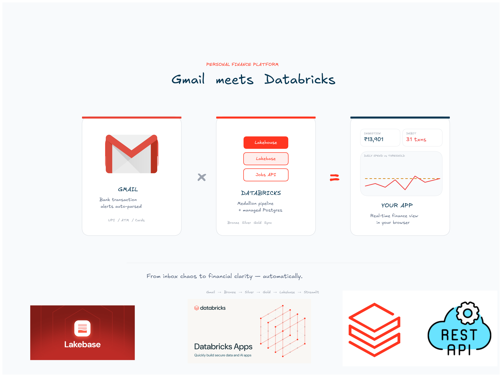
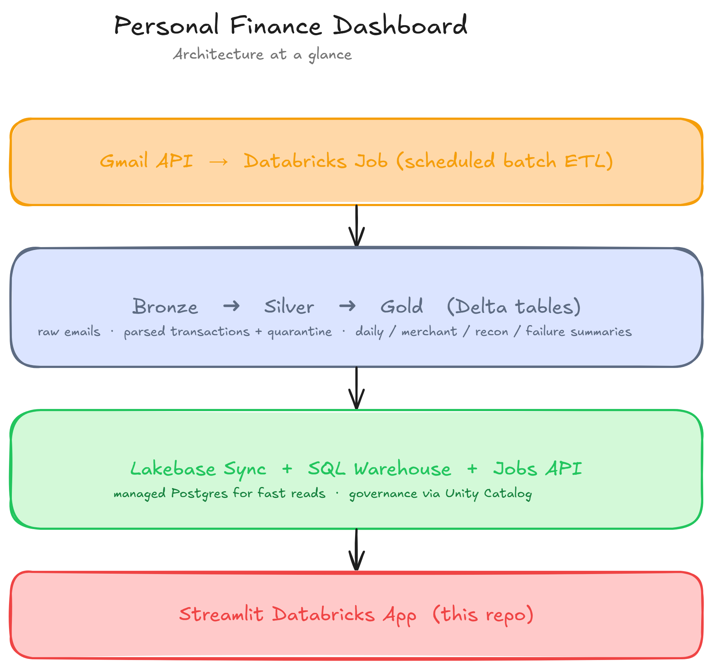
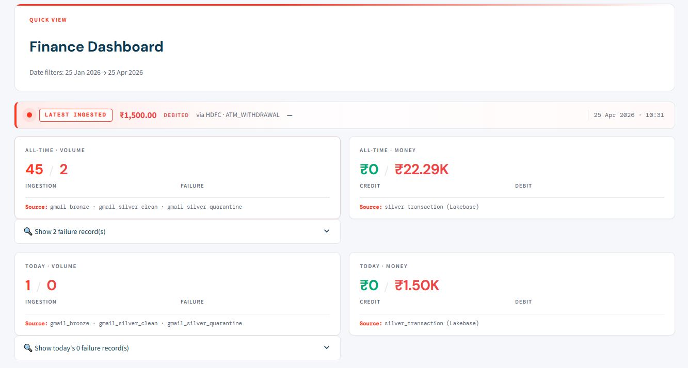
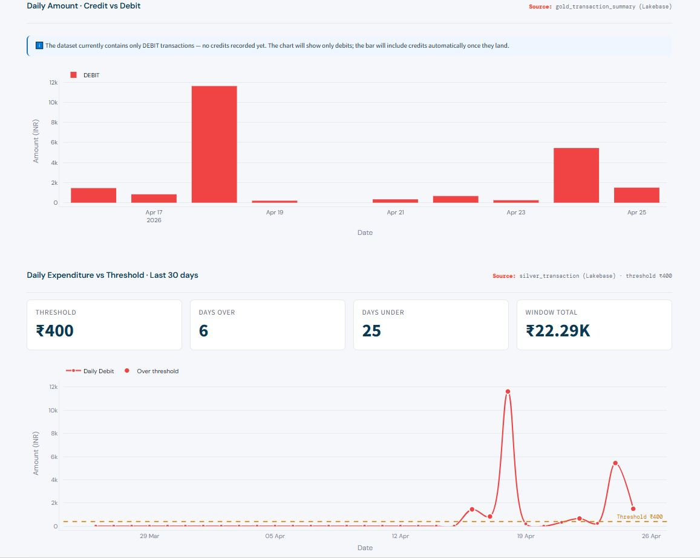
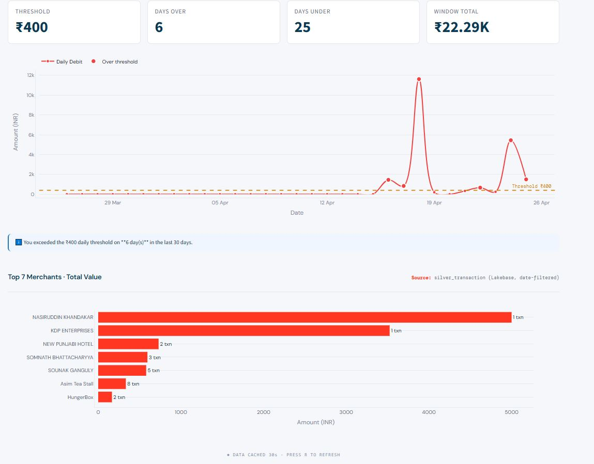
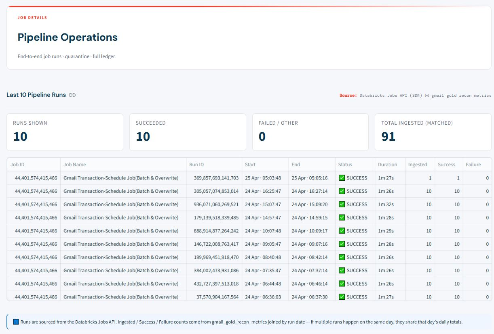
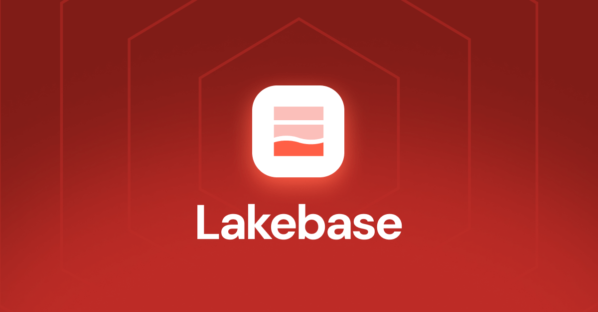
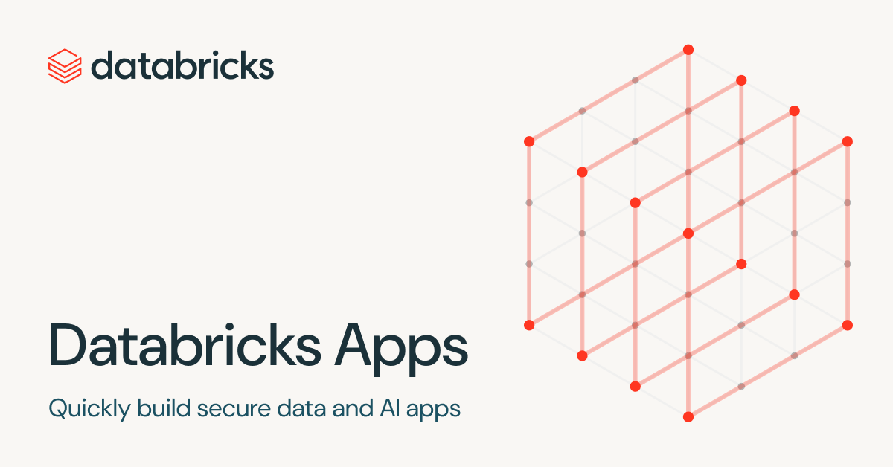

<p align="center">
  
</p>

<h1 align="center">💰 Personal Finance Dashboard on Databricks</h1>

<p align="center">
  A production-grade personal-finance dashboard built entirely on Databricks — ingesting transaction emails via an ETL pipeline, landing them in Unity Catalog, syncing to <b>Lakebase</b> (managed Postgres), and surfacing everything through a polished Streamlit app deployed as a <b>Databricks App</b>.
</p>

<p align="center">
  
  
  
  
  
  
</p>

<p align="center">
  <b>#Databricks</b> · <b>#Lakehouse</b> · <b>#Lakebase</b> · <b>#DataEngineering</b> · <b>#Streamlit</b> · <b>#PersonalFinance</b> · <b>#FinTech</b> · <b>#MedallionArchitecture</b> · <b>#UnityCatalog</b> · <b>#DeltaLake</b> · <b>#ETL</b> · <b>#OpenSource</b>
</p>

---

## ✨ Features

### 📊 Page 1 — Quick View
- **Latest-transaction ticker** — animated banner showing the newest ingested transaction (amount, merchant, bank, timestamp) with pulsing status dot and shimmer animation
- **All-time KPIs** — Volume (Ingestion / Failure) and Money (Credit / Debit) with source-table annotations on every tile
- **Today's KPIs** — scoped to email arrival date (`event_time`), not ingestion date, so re-runs don't inflate "today" to match "all-time"
- **Latest 5 transactions** — date-filtered, with NULL-safe timestamps via `COALESCE`
- **Daily Credit vs Debit** — grouped bar chart from the Lakebase gold table
- **Daily Expenditure vs Threshold** — line chart tracking daily debits against a configurable budget (default ₹400), with amber reference line and alert markers on over-threshold days
- **Top N Merchants** — horizontal bar chart, configurable N
- **Click-to-drill-down failures** — expanders reveal quarantine rows with array-typed failure reasons (numpy-array-safe)

### ⚙️ Page 2 — Job Details
- **Last 10 Pipeline Runs** — from the Databricks Jobs REST API, joined by date with daily reconciliation metrics
- **Bad Records · Quarantine** — grid merged with aggregated failure-reason counts
- **Full Transaction Ledger** — paginated (25/page), sorted by `COALESCE(txn_datetime_local, event_time) DESC`, with CSV export

### 🎨 Design
- Databricks visual language — Lava Red (`#FF3621`) accent, DM Sans typography, light cards with hover states
- Custom Streamlit components: animated ticker banner, dual-value KPI cards, section headers with source attribution

---

## 🏗️ Architecture

<p align="center">
  
</p>

The pipeline follows the **medallion pattern** end-to-end:

1. **Source** — Gmail API ingested via a scheduled Databricks Job (batch ETL)
2. **Medallion (Lakehouse)** — Bronze (raw email payloads) → Silver (parsed transactions + a quarantine table for malformed rows) → Gold (daily / merchant / reconciliation / failure-reason summaries)
3. **Serving (Lakebase + APIs)** — Lakebase (managed Postgres) syncs key tables for sub-100ms reads; SQL Warehouse handles ad-hoc queries; Jobs API surfaces pipeline run history
4. **App** — Streamlit deployed as a Databricks App, reading exclusively from the serving layer

---

## 📸 Sample Output

The dashboard renders four primary surfaces — a hero banner with live KPIs, a daily expenditure-vs-threshold chart, an operations grid for pipeline runs, and a paginated transaction ledger.

### 1️⃣ Quick View — KPIs & Latest Activity
<p align="center">
  
</p>

The landing page leads with the **animated "Latest Ingested" ticker** — pulsing red dot, shimmer effect, color-coded amount — giving you instant visibility into the newest transaction. Below it, four dual-value KPI cards summarize **All-time** and **Today** activity: Volume (Ingestion / Failure) and Money (Credit / Debit). Every tile carries a `Source:` footer naming the exact backing tables, so debugging is trivial.

### 2️⃣ Daily Spend vs Threshold
<p align="center">
  
</p>

A **configurable spending threshold** (default ₹400) is rendered as an amber dashed reference line; daily debit totals appear as a smooth red spline. Days that exceed the threshold get oversized markers — glanceable at a distance. Four mini-KPIs above the chart summarise Threshold, Days Over, Days Under, and Window Total, with a contextual info-note when the threshold is exceeded.

### 3️⃣ Top Merchants & Daily Trend
<p align="center">
  
</p>

The **Top N Merchants** horizontal bar chart (configurable from the sidebar) reveals where money actually goes — by counterparty, with transaction counts shown alongside totals. Above it, the **Daily Credit vs Debit** grouped bar chart sources from the Lakebase gold summary, automatically annotating chart context when one direction is empty (your data may have only debits at first).

### 4️⃣ Operations & Full Ledger
<p align="center">
  
</p>

Page 2 is the **operations view**: the last 10 pipeline runs from the Databricks Jobs REST API (with status, duration, and joined ingest/success/failure counts), the bad-records quarantine grid (numpy-array-safe rendering of the `failure_reasons` column), and the **full transaction ledger** paginated 25-per-page with CSV export.

---

## 🌊 Why Lakehouse + Lakebase Together — The Modern Data Platform Pattern

This dashboard isn't just running on Databricks — it's running on the **two complementary halves** of Databricks' data platform working in concert. Understanding why this pairing matters is understanding why modern apps don't pick "one or the other".

### 🏔️ The Lakehouse (Delta Lake + Unity Catalog) — for Analytics
The Lakehouse is where **truth lives**: open-format Delta tables that your ETL pipeline writes to, governed by Unity Catalog, queryable by Spark, SQL Warehouses, BI tools, and ML notebooks. It's optimized for **scale, schema evolution, time-travel, and analytics queries** — scanning millions of rows, joining wide tables, computing aggregates.

But it's *not* optimized for what an interactive dashboard actually needs: **a single user clicking "next page" and expecting a 50ms response**.

### 🐘 Lakebase (managed Postgres) — for Apps
Lakebase is Databricks' **managed Postgres**, designed specifically for the operational/serving layer. It gives the app:
- **Sub-100ms point lookups** — the ledger pagination feels instant
- **Real ANSI SQL** that Postgres clients understand natively
- **Indexes, constraints, transactions** — relational features Spark doesn't offer
- **Auto-scaling 0.5–1 CU** with scale-to-zero — cheap to run, no warehouse warm-up
- **Synced tables** — Delta changes flow into Postgres automatically via CDC

### 🔗 The Critical Bridge — Synced Tables
The magic isn't either system alone — it's the **CDC-based sync** between them. Your ETL writes once to Delta. A Lakebase Synced Table observes the Delta change-data-feed and **mirrors changes into Postgres in near-real-time**. Same governance, same lineage, same access control. **One write, two read paths.**

### 🎯 Why This Matters in Modern Platforms

| Without Lakehouse + Lakebase | With Lakehouse + Lakebase |
|---|---|
| Pick Postgres → no analytics, ML, or scale | ✅ Both worlds available, no compromise |
| Pick Delta → slow interactive UIs | ✅ Delta for the truth, Postgres for the app |
| Maintain a separate ETL into Postgres | ✅ Sync handles it; one pipeline, two surfaces |
| Reconcile two security models | ✅ Unity Catalog governs both |
| Pay for an always-on transactional DB | ✅ Lakebase scales to zero when idle |

This pattern — **batch analytics on Delta, low-latency serving on Postgres, unified by sync** — is the emerging standard for data-driven apps. Companies like Stripe, Airbnb, and Shopify use variations of this architecture; Databricks is the first platform to offer it as a single managed product.

In this project specifically:
- **Page 2's Full Ledger** (paginated 25/page) reads from Lakebase — would feel sluggish on Delta
- **Page 1's All-Time aggregates** read from gold Delta tables via the SQL Warehouse — Spark crunches the math faster than Postgres
- **Jobs API** complements both for operational metadata (run history) — no ETL needed

The dashboard is **fast, governed, observable, and cheap** because every layer is doing what it's designed to do.

---

## 🔄 ETL Pipeline — From Inbox to Dashboard

Below is the data-flow story end-to-end — each surface picture reflects a real component you can click through in your own workspace.

### 1. Ingest — Gmail as Source of Truth
<p align="center">
  
</p>

A scheduled Databricks Job pulls bank-transaction emails from Gmail using the Gmail API. Every UPI, ATM withdrawal, and card transaction generates an email — those are our raw signal. Each batch lands as a row in `gmail_bronze` (Delta) with the original payload, sender, subject, body, and `event_time` (when the email actually arrived).

### 2. Transform — Medallion in the Lakehouse
The bronze rows flow through PySpark transformations that parse amount, direction, counterparty, VPA, and timestamps from the body. Successful parses land in `gmail_silver_clean`; malformed rows go to `gmail_silver_quarantine` with an array of `failure_reasons`. Aggregations roll up into four gold tables: daily summary, merchant summary, reconciliation metrics, and failure-reason counts.

> See `pyspark/01_bronze_to_silver_gmail_txn.py` and `pyspark/02_silver_to_gold_gmail_views.py` for the actual transformation code.

### 3. Serve — Lakebase Sync
<p align="center">
  
</p>

Three Lakebase Synced Tables mirror the silver and gold layers into managed Postgres:
- `silver_transaction` — every parsed transaction, indexed by date and direction
- `gold_transaction_summary` — daily debit/credit rollups
- `gold_merchant_summary_view` — merchant aggregates

CDC keeps these fresh as new bronze data flows through the medallion. The dashboard reads exclusively from these — sub-100ms response on every page click.

### 4. Surface — The Databricks App
<p align="center">
  
</p>

Streamlit packaged as a Databricks App — same workspace, same auth, same governance. The app's service principal has narrow grants (SELECT on the schema, USE on the warehouse, VIEW on the ETL job) and connects via OAuth tokens that the SDK refreshes automatically.

### 5. Observe — Jobs REST API
<p align="center">
  
</p>

Page 2's "Last 10 Pipeline Runs" calls `w.jobs.list_runs(...)` directly — no system-table grants required, just `CAN_VIEW` on the job itself. Each row joins by date with `gmail_gold_recon_metrics` to enrich the run with ingest/success/failure counts.

---

## 🧰 Tech Stack

| Layer | Tech |
|---|---|
| **Compute** | Databricks Apps (serverless), Databricks SQL Warehouse (serverless) |
| **Storage** | Unity Catalog Delta tables, Lakebase (managed Postgres 17, autoscale 0.5–1 CU) |
| **Ingestion** | Databricks Jobs (scheduled batch ETL) |
| **Sync** | Lakebase Synced Tables (CDC-based) |
| **Auth** | Databricks OAuth (SDK-managed token refresh) |
| **App Framework** | Streamlit 1.39 |
| **Data** | pandas 2.2, Plotly 5.24 |
| **SDKs** | databricks-sdk 0.38, databricks-sql-connector 3.7 |

---

## 🗂️ Project Structure

```
databricks-finance-dashboard/
├── app.py                         # Page 1 — Quick View
├── app.yaml                       # Databricks Apps manifest (command, env vars)
├── requirements.txt               # Python dependencies
├── lib/
│   ├── data.py                    # Warehouse connection, token refresh, query cache
│   ├── formatters.py              # INR formatter, numpy-safe array-to-string
│   └── theme.py                   # Design system: KPI cards, ticker, plotly defaults
├── pages/
│   └── 1_⚙️_Job_Details.py       # Page 2 — Operations view
├── pyspark/                       # Reference upstream ETL (run as Databricks Jobs)
│   ├── 01_bronze_to_silver_gmail_txn.py
│   └── 02_silver_to_gold_gmail_views.py
└── docs/
    ├── Banner.png                 # Hero banner
    ├── Architecture.png           # System architecture diagram
    ├── Finance-1.JPG ... 4.JPG    # Dashboard screenshots
    ├── 01.Gmail.png               # ETL pipeline visuals
    ├── 03.Lakebase.png
    ├── 04.databricksApp.png
    └── 05.Job-Databricks API.png
```

---

## 🚀 Deployment

### Prerequisites
- Databricks workspace with Unity Catalog, a Serverless SQL Warehouse, and Databricks Apps enabled
- A Lakebase database provisioned
- An upstream ingestion pipeline producing these tables (not included in this repo):
  - `<catalog>.<schema>.gmail_bronze`
  - `<catalog>.<schema>.gmail_silver_clean`
  - `<catalog>.<schema>.gmail_silver_quarantine`
  - `<catalog>.<schema>.gmail_gold_recon_metrics`
  - `<catalog>.<schema>.gmail_gold_failure_reasons`
- Lakebase-synced tables:
  - `<catalog>.<schema>.silver_transaction`
  - `<catalog>.<schema>.gold_transaction_summary`
  - `<catalog>.<schema>.gold_merchant_summary_view`

### Deploy

1. **Clone** the repo:
   ```bash
   git clone https://github.com/<your-username>/databricks-finance-dashboard.git
   ```

2. **Configure** `app.yaml`:
   ```yaml
   env:
     - name: "SOURCE_CATALOG"
       value: "your_catalog"
     - name: "SOURCE_SCHEMA"
       value: "your_schema"
     - name: "JOB_IDS"
       value: ""   # Optional: comma-separated job IDs for Page 2
   ```

3. **Upload to workspace**:
   ```bash
   databricks workspace import-dir . /Workspace/Users/you@example.com/finance-dashboard
   ```

4. **Create the app** in Databricks UI → Apps → Create, pointing to that path.

5. **Grant the App's service principal**:
   - `USE CATALOG` + `USE SCHEMA` + `SELECT` on your schema
   - `CAN USE` on your SQL warehouse
   - `CAN VIEW` on each ingestion job (for Page 2 runs panel)

---

## ⚙️ Configuration

| Variable | Default | Purpose |
|---|---|---|
| `SOURCE_CATALOG` | `finance_zerobus` | Unity Catalog catalog |
| `SOURCE_SCHEMA` | `transaction` | Schema within the catalog |
| `JOB_IDS` | *(empty)* | Comma-separated job IDs for Page 2; empty → list all visible jobs |
| `STREAMLIT_THEME_*` | Databricks palette | Colors, fonts, base theme |

See `.env.example` for a full template.

---

## 🛠️ Engineering Highlights

- **Token-refresh resilience** — OAuth tokens refreshed on every connection with retry-on-401/403 fallback; no more 1-hour `403 FORBIDDEN` crashes
- **NULL-safe timestamps** — uses `COALESCE(txn_datetime_local, event_time)` throughout since upstream doesn't always populate the primary timestamp
- **Array-typed column handling** — custom `arr_to_str()` helper handles numpy arrays (what the Databricks SQL connector returns for `ARRAY<STRING>`), Python lists, None, and scalars uniformly
- **Graceful fallbacks** — Page 2 runs panel falls back to daily recon metrics when the SP lacks view permission on jobs
- **Source transparency** — every tile shows its source table(s) in a footer for debugging
- **"Today" means email arrival** — counts use `event_time` rather than `_bronze_ingested_at`, so pipeline re-runs don't inflate today's numbers

---

## 🛡️ Security

- No credentials in code — uses Databricks' OAuth flow via the SDK
- App runs as a service principal with least-privilege grants
- Lakebase connections use SDK-managed tokens, not long-lived passwords
- Authentication is workspace-enforced; no anonymous access (by Databricks Apps design)

---

## 📝 License

MIT — see [LICENSE](LICENSE).

---

## 🙏 Acknowledgments

Built iteratively with [Claude](https://claude.ai) using the Databricks MCP integration. Every tile, query, and CSS rule was live-tested against a real data pipeline.

---

<p align="center">
  <i>From inbox chaos to financial clarity — automatically.</i>
</p>

<p align="center">
  <b>#Databricks</b> · <b>#Lakehouse</b> · <b>#Lakebase</b> · <b>#DataPlatform</b> · <b>#StreamingETL</b> · <b>#Postgres</b> · <b>#PySpark</b> · <b>#FinTech</b>
</p>
